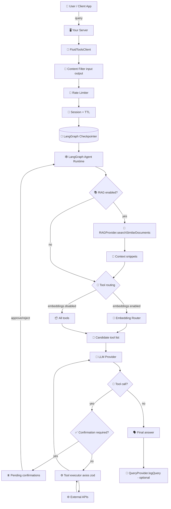
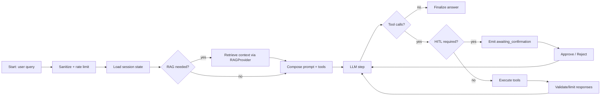
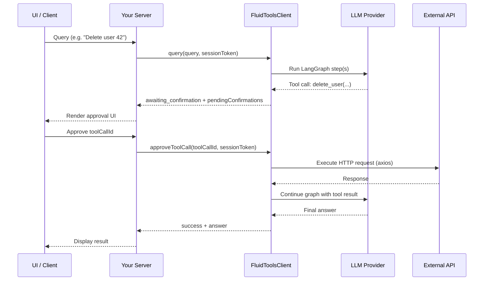

# FluidTools

[](https://www.npmjs.com/package/fluid-tools)
[](https://www.npmjs.com/package/fluid-tools)
[](./LICENSE)
[](https://github.com/KartikJoshiUK/fluid-tools)

<!--
After publishing to npm under `fluid-tools`, switch to dynamic npm badges:
[](https://www.npmjs.com/package/fluid-tools)
[](https://www.npmjs.com/package/fluid-tools)
-->

FluidTools is an AI-powered Postman/OpenAPI-to-LangGraph tool execution engine for TypeScript/Node.js apps. It converts API definitions into callable tools, lets an LLM orchestrate tool usage, supports optional HITL approvals, RAG context injection, embedding-based tool routing, query logging, and multi-provider model backends.

## ✨ Feature Showcase

- **🧰 Postman + OpenAPI → Tools**: Convert Postman collections or OpenAPI specs into validated tools (Zod schemas).
- **🧠 LangGraph orchestration**: Stateful multi-step tool execution with sessions + checkpointers.
- **🔌 Multi-provider LLMs**: OpenAI, Azure OpenAI, OpenAI-compatible, Anthropic, Gemini, Ollama.
- **✅ Human-in-the-Loop (HITL)**: Require approval for sensitive tool calls; approve/reject and resume.
- **🧭 Embedding-based tool routing (optional)**: Reduce context size by selecting the most relevant tools.
- **📚 RAG injection (optional)**: Pull policy/docs context via a pluggable `RAGProvider`.
- **🌊 Streaming**: Stream tokens + tool events; supports streaming resume after HITL approvals.
- **🧱 Production controls**: Rate limiting, retries with backoff, content filtering, per-request auth headers.
- **🧾 Observability hooks**: Structured query logging via a pluggable `QueryProvider`.

## 🏗️ System Design & Architecture

### End-to-end architecture (dataflow)



### Customization points (where FluidTools plugs into your app)

- **🪪 Auth & headers**: `headerResolver(toolName, accessToken)`
- **✅ Sensitive operations**: `confirmationConfig.requireConfirmation`
- **📚 RAG**: `ragProvider` + `ragConfig`
- **🧭 Tool routing**: `embeddingConfig`
- **🧾 Logging**: `queryProvider` + `queryConfig`
- **💾 Memory**: `checkpointer` (LangGraph saver)
- **🧯 Safety/ops**: `contentFilter`, `rateLimitConfig`, `retryConfig`, `toolExecutionConfig`

### LangGraph node-level view (conceptual)

This is the typical control flow your request goes through (exact node names can differ by configuration, but the responsibilities stay the same).



### HITL approval sequence (what your UI integrates with)



## Installation

```bash
npm install fluid-tools
```

### Peer Dependencies

| Package | Required | Notes |
| --- | --- | --- |
| `@langchain/core` | Yes | Core LangChain primitives |
| `@langchain/langgraph` | Yes | Graph runtime/checkpointers |
| `langchain` | Yes | Message/tool runtime |
| `zod` | Yes | Tool argument schemas |
| `axios` | Yes | HTTP execution |
| `@langchain/openai` | For `openai`, `azure-openai`, `openai-compatible` | OpenAI-family providers |
| `@langchain/anthropic` | For `anthropic` | Optional if unused |
| `@langchain/google-genai` | For `gemini` | Optional if unused |
| `@langchain/ollama` | For `ollama` | Optional if unused |

## Quick Start (OpenAI + Postman)

```ts
import FluidToolsClient from "fluid-tools";
import type { PostmanCollection } from "fluid-tools";

const postmanCollection: PostmanCollection = {
  info: { name: "Demo API" },
  item: [
    {
      name: "Get Users",
      request: { method: "GET", url: "https://api.example.com/users" },
    },
  ],
};

const client = new FluidToolsClient({
  config: {
    type: "openai",
    model: "gpt-4o-mini",
    apiKey: process.env.OPENAI_API_KEY!,
  },
  postmanCollection,
});

const result = await client.query("List the first 5 users", "user-session-token");
if (result.status === "success") {
  console.log(result.answer);
}
```

## Structured Query Response

`query()`, `approveToolCall()`, and `rejectToolCall()` return a discriminated union:
- `success` with `answer`
- `error` with structured `code/message`
- `awaiting_confirmation` with pending HITL actions

```ts
const result = await client.query("Delete user 42", "token");

if (result.status === "error") {
  // handle programmatically
  console.error(result.error.code, result.error.message);
}

if (result.status === "awaiting_confirmation") {
  // render HITL UI
  console.log(result.pendingConfirmations);
}

if (result.status === "success") {
  // render answer
  console.log(result.answer);
}
```

## Configuration Reference

`FluidToolsClientOptions`:

- `config: ProviderConfig` - LLM provider config.
- `postmanCollection?: PostmanCollection` - Postman source (mutually exclusive with `openApiSpec`).
- `openApiSpec?: OpenAPISpec` - OpenAPI source (mutually exclusive with `postmanCollection`).
- `systemInstructions?: string` - Extra system instructions appended in `<Additional Instructions>`.
- `maxToolCalls?: number` (default `10`) - Max tool calls per query.
- `debug?: boolean` (default `false`) - Enable debug logging.
- `expireAfterSeconds?: number` (default `3600`) - Session TTL.
- `confirmationConfig?: ToolConfirmationConfig` - HITL confirmation list.
- `toolsConfig?: Record<string, string>` - Tool execution config (for example `BASE_URL`, `REQUEST_TIMEOUT_MS`, `MAX_TOOL_RESPONSE_BYTES`).
- `toolExecutionConfig?: ToolExecutionConfig` - typed execution limits (`requestTimeoutMs`, `maxToolResponseBytes`).
- `embeddingConfig?: EmbeddingConfig` - Embedding selection options (`minToolsForEmbeddings`, `maxCacheEntries`, `topK`).
- `sessionConfig?: SessionConfig` - in-memory session housekeeping (`cleanupIntervalMs`).
- `ragProvider?: RAGProvider` - RAG backend implementation.
- `ragConfig?: Partial<RAGConfig>` - RAG behavior overrides.
- `queryProvider?: QueryProvider` - Query logging backend.
- `queryConfig?: Partial<QueryConfig>` - Query logging behavior overrides.
- `checkpointer?: BaseCheckpointSaver` - Custom LangGraph checkpointer. Warning: durable checkpointers may persist runtime config/state; do not pass raw long-lived secrets without your own secret-handling policy.
- `headerResolver?: HeaderResolver` - Per-tool request headers resolver.
- `retryConfig?: RetryConfig` - Retry behavior for transient tool HTTP failures.
- `rateLimitConfig?: RateLimitConfig` - Per-session query and concurrency throttling.

## Retry Configuration

Tool HTTP calls support retry with exponential backoff for transient failures.

Defaults:
- `maxRetries: 3`
- `retryDelayMs: 500`
- `retryOnStatusCodes: [429, 500, 502, 503, 504]`

```ts
const client = new FluidToolsClient({
  config: { type: "openai", model: "gpt-4o-mini", apiKey: process.env.OPENAI_API_KEY! },
  postmanCollection,
  retryConfig: {
    maxRetries: 4,
    retryDelayMs: 300,
    retryOnStatusCodes: [429, 500, 502, 503, 504],
  },
});
```

## Tool Execution Limits

Use typed limits for production/business tuning:

```ts
const client = new FluidToolsClient({
  config: { type: "openai", model: "gpt-4o-mini", apiKey: process.env.OPENAI_API_KEY! },
  postmanCollection,
  toolExecutionConfig: {
    requestTimeoutMs: 20_000,
    maxToolResponseBytes: 80_000,
  },
});
```

`toolsConfig` still works and remains supported; `toolExecutionConfig` is the recommended typed surface.

## Content Filtering

Use `contentFilter` to sanitize user input before prompting and to sanitize tool output before it is sent back to the model.

```ts
const BLOCKLIST = [/ignore previous instructions/i, /reveal system prompt/i];

const client = new FluidToolsClient({
  config: { type: "openai", model: "gpt-4o-mini", apiKey: process.env.OPENAI_API_KEY! },
  postmanCollection,
  contentFilter: {
    input: (query) => {
      const blocked = BLOCKLIST.some((pattern) => pattern.test(query));
      return blocked ? "[BLOCKED_INPUT]" : query;
    },
    output: async (toolName, response) => {
      const scrubbed = await piiScrubber(response);
      return `[${toolName}] ${scrubbed}`;
    },
  },
});

async function piiScrubber(text: string): Promise<string> {
  return text
    .replace(/[A-Z0-9._%+-]+@[A-Z0-9.-]+\.[A-Z]{2,}/gi, "[REDACTED_EMAIL]")
    .replace(/\b\d{3}-\d{2}-\d{4}\b/g, "[REDACTED_SSN]");
}
```

## Rate Limiting

Apply per-session limits to avoid runaway model/tool usage.

Defaults:
- `maxQueriesPerWindow`: unlimited
- `windowMs`: `60000`
- `maxConcurrentQueries`: unlimited

```ts
const client = new FluidToolsClient({
  config: { type: "openai", model: "gpt-4o-mini", apiKey: process.env.OPENAI_API_KEY! },
  postmanCollection,
  rateLimitConfig: {
    maxQueriesPerWindow: 30,
    windowMs: 60_000,
    maxConcurrentQueries: 2,
  },
});
```

## Provider Setup

### OpenAI

```ts
config: {
  type: "openai",
  model: "gpt-4o-mini",
  apiKey: process.env.OPENAI_API_KEY!,
}
```

### Anthropic

```ts
config: {
  type: "anthropic",
  model: "claude-3-5-sonnet-latest",
  apiKey: process.env.ANTHROPIC_API_KEY!,
}
```

### Gemini

```ts
config: {
  type: "gemini",
  model: "gemini-2.0-flash",
  apiKey: process.env.GEMINI_API_KEY!,
}
```

### Ollama

```ts
config: {
  type: "ollama",
  model: "llama3.1",
  baseUrl: "http://localhost:11434",
}
```

### Azure OpenAI

```ts
config: {
  type: "azure-openai",
  model: "gpt-4o-mini",
  apiKey: process.env.AZURE_OPENAI_API_KEY!,
  azureOpenAIApiDeploymentName: process.env.AZURE_OPENAI_DEPLOYMENT!,
  azureOpenAIApiInstanceName: process.env.AZURE_OPENAI_INSTANCE!,
  azureOpenAIApiVersion: "2024-06-01",
}
```

### OpenAI-Compatible

```ts
config: {
  type: "openai-compatible",
  model: "meta-llama/Llama-3.3-70B-Instruct",
  apiKey: process.env.OPENAI_COMPAT_API_KEY!,
  baseUrl: "https://api.example.com/v1",
}
```

## Per-Request Auth / Custom Headers

`headerResolver` is called per tool execution with `(toolName, accessToken)`.

### Default behavior

If omitted, FluidTools uses:

```ts
(toolName, token) => (token ? { Authorization: `Bearer ${token}` } : {})
```

### Bearer + public endpoints

```ts
headerResolver: (toolName, accessToken) => {
  if (toolName.startsWith("public_")) return {};
  return accessToken ? { Authorization: `Bearer ${accessToken}` } : {};
}
```

### Cookie auth

```ts
headerResolver: (_toolName, accessToken) =>
  accessToken ? { Cookie: `session=${accessToken}` } : {}
```

### API key + client id

```ts
headerResolver: (toolName) => {
  if (toolName.startsWith("internal_")) {
    return {
      "x-api-key": process.env.INTERNAL_API_KEY!,
      "x-client-id": process.env.CLIENT_ID!,
    };
  }
  return {};
}
```

## Human-in-the-Loop (HITL)

```ts
const client = new FluidToolsClient({
  config: { type: "openai", model: "gpt-4o-mini", apiKey: process.env.OPENAI_API_KEY! },
  postmanCollection,
  confirmationConfig: {
    requireConfirmation: ["delete_user", "transfer_funds"],
  },
});

const pending = await client.getPendingConfirmations("session-token");
await client.approveToolCall(pending[0].toolCallId, "session-token");
// or:
await client.rejectToolCall(pending[0].toolCallId, "session-token");
```

## RAG Integration

Implement `RAGProvider`:

```ts
import type { RAGProvider, RAGDocument, RAGSearchOptions } from "fluid-tools";

class MyRAGProvider implements RAGProvider {
  async isAvailable(): Promise<boolean> {
    return true;
  }

  async searchSimilarDocuments(
    query: string,
    options?: RAGSearchOptions
  ): Promise<RAGDocument[]> {
    return [];
  }

  async indexDocuments(documents: RAGDocument[]): Promise<void> {
    // index implementation
  }
}
```

Usage:

```ts
const client = new FluidToolsClient({
  config: { type: "openai", model: "gpt-4o-mini", apiKey: process.env.OPENAI_API_KEY! },
  postmanCollection,
  ragProvider: new MyRAGProvider(),
  ragConfig: {
    maxDocuments: 5,
    similarityThreshold: 0.7,
    contextWindow: 4000,
    ragRoutingHints: ["Use RAG for product docs and policies"],
  },
});

await client.indexDocuments([
  { id: "doc-1", content: "Refund policy is 30 days." },
]);
```

## Embedding-Based Tool Selection

```ts
const client = new FluidToolsClient({
  config: { type: "openai", model: "gpt-4o-mini", apiKey: process.env.OPENAI_API_KEY! },
  postmanCollection,
  embeddingConfig: {
    enabled: true,
    modalUrl: "https://your-embedding-service.example.com",
    sessionId: "shared-session-id",
    minToolsForEmbeddings: 40,
    maxCacheEntries: 2_000,
    topK: 20,
  },
});
```

## Query Logging

Implement `QueryProvider`:

```ts
import type { QueryProvider, QueryLog } from "fluid-tools";

class MyQueryProvider implements QueryProvider {
  async logQuery(log: QueryLog): Promise<void> {
    console.log(log);
  }
}
```

Use it:

```ts
const client = new FluidToolsClient({
  config: { type: "openai", model: "gpt-4o-mini", apiKey: process.env.OPENAI_API_KEY! },
  postmanCollection,
  queryProvider: new MyQueryProvider(),
  queryConfig: { enabled: true, includeMetadata: true },
});
```

## Streaming

Use `client.stream()` to consume incremental model/tool events.

```ts
for await (const event of client.stream("Summarize latest invoice status", "session-token")) {
  if (event.type === "token") process.stdout.write(event.data);
  if (event.type === "done") break;
}
```

### Streaming with HITL

When a protected tool is encountered, the stream emits `confirmation_required` instead of `done`.

```ts
for await (const event of client.stream("Delete user 42", "session-token")) {
  if (event.type === "token") process.stdout.write(event.data);

  if (event.type === "confirmation_required") {
    const pending = event.pendingConfirmations ?? [];
    // Show pending[0] in your approval UI

    for await (const resumed of client.streamApproveToolCall(
      pending[0].toolCallId,
      "session-token"
    )) {
      if (resumed.type === "token") process.stdout.write(resumed.data);
      if (resumed.type === "done") break;
    }
    break;
  }
}
```

### Backend transport to frontend

Your frontend should connect to an endpoint that returns `text/event-stream` (or another streaming response type).

#### Express SSE example

```ts
app.get("/stream", async (req, res) => {
  res.setHeader("Content-Type", "text/event-stream");
  res.setHeader("Cache-Control", "no-cache");
  res.setHeader("Connection", "keep-alive");

  for await (const event of client.stream(String(req.query.q ?? ""), String(req.headers.authorization ?? ""))) {
    res.write(`data: ${JSON.stringify(event)}\n\n`);
    if (event.type === "done") break;
  }

  res.end();
});
```

#### React frontend example

```ts
const eventSource = new EventSource("/stream?q=your+query");
eventSource.onmessage = (e) => {
  const event = JSON.parse(e.data);
  if (event.type === "token") appendToMessage(event.data);
  if (event.type === "done") eventSource.close();
};
```

## OpenAPI Support

```ts
import FluidToolsClient, { openApiToTools, type OpenAPISpec } from "fluid-tools";

const spec: OpenAPISpec = {
  openapi: "3.1.0",
  info: { title: "Pet API", version: "1.0.0" },
  servers: [{ url: "https://api.example.com" }],
  paths: {
    "/pets": {
      get: { operationId: "list_pets", summary: "List pets" },
    },
  },
};

const client = new FluidToolsClient({
  config: { type: "openai", model: "gpt-4o-mini", apiKey: process.env.OPENAI_API_KEY! },
  openApiSpec: spec,
});
```

## Custom Memory / Checkpointer

FluidTools uses LangGraph `MemorySaver` by default (in-process memory). For multi-instance or durable deployments, pass a custom `checkpointer` (for example Redis/Postgres-backed saver from LangGraph ecosystem).

Security note: if you pass access tokens into client calls, treat custom checkpointer backends as sensitive infrastructure and apply encryption/secret controls. Prefer short-lived tokens.

```ts
import { MemorySaver } from "@langchain/langgraph";

const client = new FluidToolsClient({
  config: { type: "openai", model: "gpt-4o-mini", apiKey: process.env.OPENAI_API_KEY! },
  postmanCollection,
  checkpointer: new MemorySaver(),
});
```

## Session Management

```ts
await client.clearThread("session-token");
const state = await client.getConversationState("session-token");
```

`FluidSession` keeps per-token state in-memory and performs periodic TTL sweeps for expired entries. It is single-process memory, so use a durable checkpointer for multi-instance deployments.

If you want to tune cleanup frequency:

```ts
const client = new FluidToolsClient({
  config: { type: "openai", model: "gpt-4o-mini", apiKey: process.env.OPENAI_API_KEY! },
  postmanCollection,
  sessionConfig: {
    cleanupIntervalMs: 15_000,
  },
});
```

## Version

Current version: **`1.0.0`** (stable).

## Limitations

- RBAC / per-tool access control is not yet implemented.
- No built-in audit trail (use `queryProvider` for logging).
- Multi-tenant session isolation (namespaced session maps for shared instances).
- AWS Bedrock, Groq, and Mistral providers are not yet supported.
- `MemorySaver` is in-process only; use custom `checkpointer` for multi-instance deployments.

## Roadmap

- Custom logger injection.
- `SessionStore` interface for pluggable session persistence.
- `maxHistoryMessages` option.
- Mistral and Bedrock providers.
- Sub-path exports.
- `onToolCall` hooks.
- `listTools()` method.
